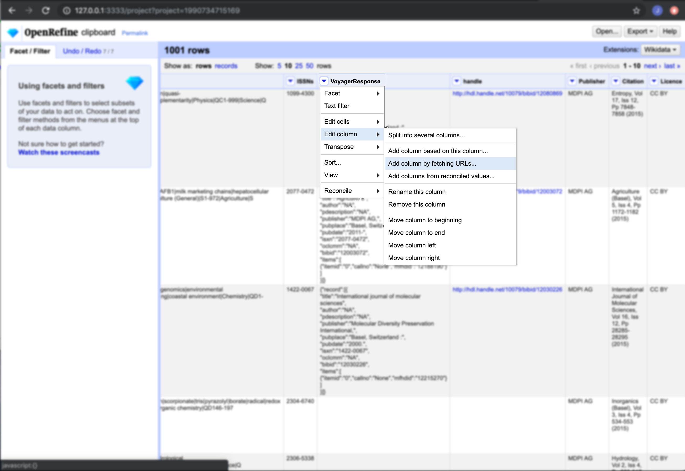
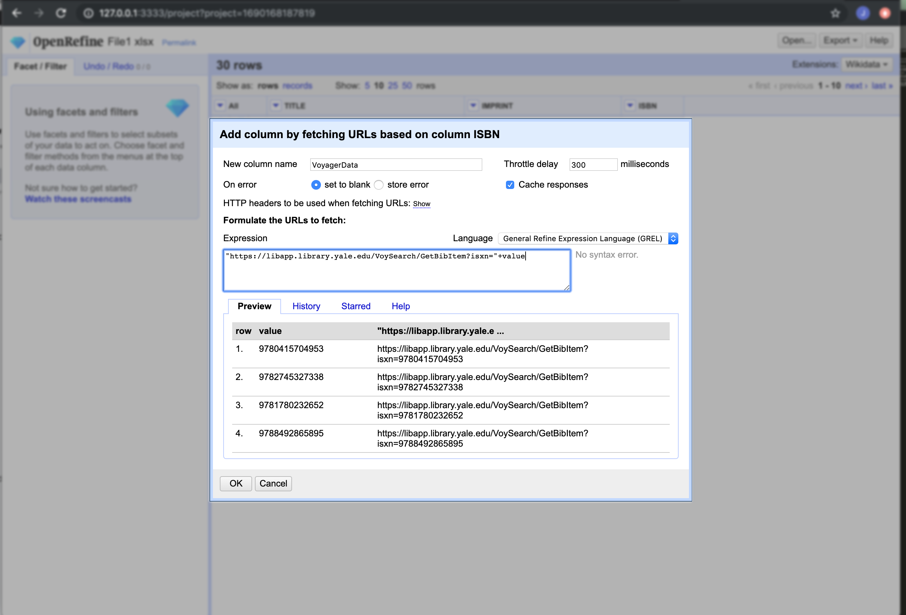
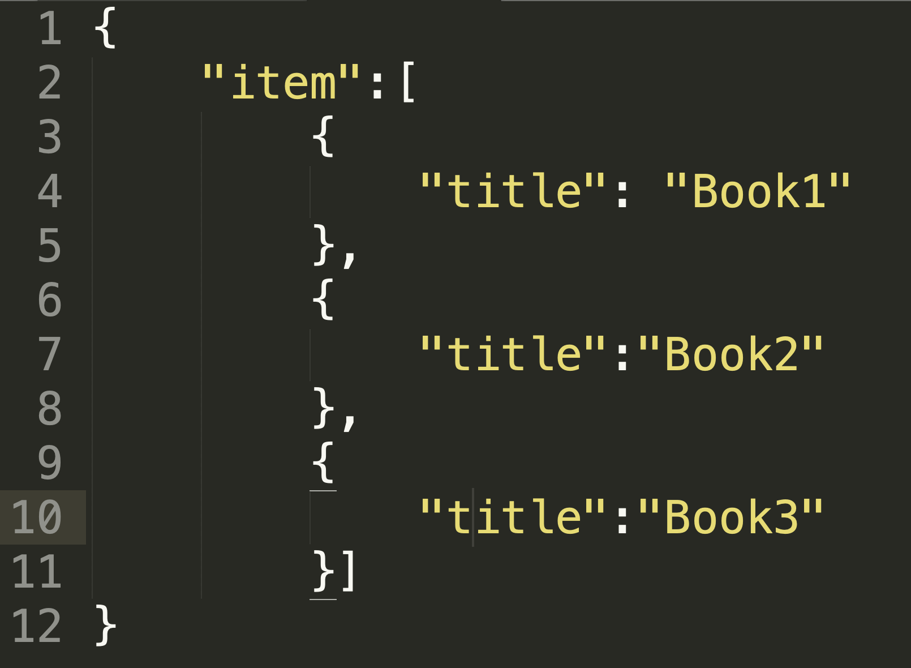

## Fetching data from the web

OpenRefine has built-in functions for accessing data through APIs. We can use the function "Add columns by fetching URLs" to pass :
- 'Edit column' -> 'Add column by fetching URLs..'

We will be using the data in File1.xlsx. The column named 'ISBN' contains ISBNs we can use to search the Voyager API. We can request the catalog data about the resource and add that data to our Excel file. 

>## Let's fetch data from Voyager
>
>1. Create a new project in OpenRefine using File1.xlsx 
>2. Select column _ISBN_ -> 'Edit column' -> 'Add column by fetching URLs...'
>3. Name new column _VoyagerData_
>4. Change 'Throttle delay' from 5000 -> 300
>5. Add the expression: `"https://libapp.library.yale.edu/VoySearch/GetBibItem?isxn=" + value`
>6. Click 'OK'
{: .checklist}

## New GREL Functions
In addition to the functions we've already covered in the [OpenRefine Lesson](https://librarycarpentry.org/lc-open-refine/), these GREL functions will help you complete the exercises in this lesson. You can find the link to the documentation for each function below:
- [parseJson( )](https://github.com/OpenRefine/OpenRefine/wiki/GREL-Other-Functions#parsejsonstring-s)
- [parseXml( ), xmlText( ), select( )](https://github.com/OpenRefine/OpenRefine/wiki/GREL-Other-Functions#jsoup-xml-and-html-parsing-functions)
- [forEach( )](https://github.com/OpenRefine/OpenRefine/wiki/GREL-Controls#foreachexpression-a-variable-v-expression-e)

## Parse JSON results

Our Voyager API query returns results in JSON format as a single cell in our excel spreadsheet. We can use OpenRefine to parse this JSON to pull out catalog data and insert this data in our spreadsheet.
- OpenRefine has a built-in function called `parseJson()` that we can use to extract specfic data from the JSON results.
- Because JSON data is often nested, we must navigate to the appropriate "key" to extract the "value".
- We often encounter data organized in an array or list, signified by square brackets: `[]`
	- To access an item in an array, we use the index number starting at zero (0)
	- In the following screenshot, we have an array a books with the key "items"
	- To get the value of "Book1", we use `item[0].title` where zero is the index for the first item & "title" is the key for the value we want to extract.
	- To get "Book2" we would use `item[1].title`, "Book3" is `item[2].title`, and so on...

>## Let's find the Call Number
>
>Let's pull out the Publisher form our JSON results and add it to a new column called _Publisher_:
>1. Create a new project using the file [File1-VoyagerJSON.xlsx](https://github.com/JoshuaDull/APIs-for-Libraries/raw/gh-pages/data/File1-VoyagerJSON.xlsx)
>1. Select _VoyagerData_ -> 'Edit column' -> 'Add column based on this column...'
>2. New column name: _Publisher_
>3. Add the expression: `value.parseJson().record[0].publisher`
>4. Click 'OK'. We should have a new column in our data with the publisher for each item. 
{: .checklist}

>## Create a link to the catalog record 
>
>1. Create a new column called _BibId_ with the bibid for each item. What steps did you take?
>2. What steps would you take to create a new column called _HandleLink_ which is a link to the catalog record for that item? (hint: `"http://hdl.handle.net/10079/bibid/" + ?`)
>
>>## Solution
>>1. Select _VoyagerData_ -> 'Edit column' -> 'Add column based on this column...'
>>- New column name: _BibId_
>>- Add the expression: `value.parseJson().record[0].bibid`
>>- Click 'OK'
>>2. Select _BibId_ -> 'Edit column' -> 'Add column based on this column...'
>>- New column name: _HandleLink_
>>- Add the expression: `"http://hdl.handle.net/10079/bibid/" + value`
>>- Click 'OK'	 
>{: .solution}
{: .challenge}

## Working with arrays

Many times when working with JSON or XML results, we need to work with an array (or list) of data. To pull out each value in an array, we use a [forEach( )](https://github.com/OpenRefine/OpenRefine/wiki/GREL-Controls#foreachexpression-a-variable-v-expression-e) loop (like the Shell _for_ loop). The next exercise will help us understand how to use the `forEach()` function. 

>## Return a JSON array or list
>
>Let's work with an array of data in JSON. We will find the location of each item in the record and save those values in a new column.
>1. Select _VoyagerData_ -> 'Edit column' -> 'Add column based on this column...'
>2. New column name: _Location_
>3. Add the expression: `forEach(value.parseJson().record[0].items,v,v.loccode).join(" | ")`
> - `forEach()` takes 3 arguements: an array, a variable, and variable.function()
>  - `value.parseJson().record[0].items` is our array
>  - `v` is our variable
>  - `v.loccode` is our function	
>4. Click 'OK'. We should have a new column in our data with an array of values.
{: .checklist}

## Fetch MARCXML records

The voyager API can also return MARCXML from certain queries. We'll use a different base URL for our next query to retrive XML: `https://libapp.library.yale.edu/VoySearch/GetBibMarc?bibid=`

>## Let's fetch MARCXML from Voyager
> 
>1. Select column _BibId_ -> 'Edit column' -> 'Add column by fetching URLs...'
>2. Name new column _MARCXML_
>3. Change 'Throttle delay' from 5000 -> 300
>4. Add the expression: `"https://libapp.library.yale.edu/VoySearch/GetBibMarc?bibid=" + value`
>5. Click 'OK'
{: .checklist}

## Parse XML results

Our Voyager API query returns reults in MARCXML format for each item in a single cell. We can parse the XML like we did previously with JSON.
- `parseXml()` works like `parseJson()`; it tells OpenRefine we're working with XML
- We use the function `select()` to choose the XML element we want. `select()` always returns an array.
- We use the function `xmlText()` to remove the XML tags from any results and return just the text inside an element.

>## Parse MARCXML results
> We need to parse the MARCXML to pull out data about each item. 
> The steps below will walk through creating a new column that contains the Call Number for each item in our dataset.
>1. Create a new project using the file [File1-VoaygerMARC.xlsx](https://github.com/JoshuaDull/APIs-for-Libraries/raw/gh-pages/data/File1-VoaygerMARC.xlsx)
>1. Select column _MARCXML_ -> 'Edit column' -> 'Add column based on this column...'
>2. Name new column: _CallNo_
>3. Add the expression (don't click OK yet): `value.parseXml().select("datafield[tag=050]")`
> - We use `select()` to select the element with the Call number.
> - The Call number is found in an element called _datafield_ with an attribute called _tag_ that is equal to _050_.
> 
> - The preview shows us our results. We should see an array of a single XML element that contain a Call Number.
>4. To get just the CallNo, we need to access the first, and only, item in our array. Add `[0]` to the end of your expression to find the item at the zeroth index position. 
>5. To escape the XML tags, we add the function `xmlText()` to our expression. We should be left with just the Call Number. 
> 6. Your full expressions should now read: `value.parseXml().select("datafield[tag=050]")[0].xmlText()`. Click 'OK'.
> 
{: .checklist}
